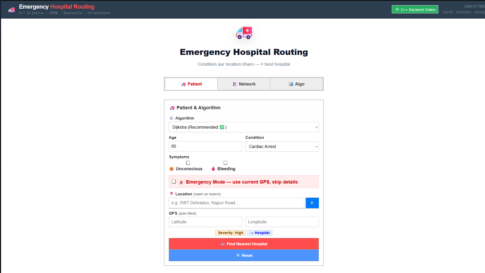
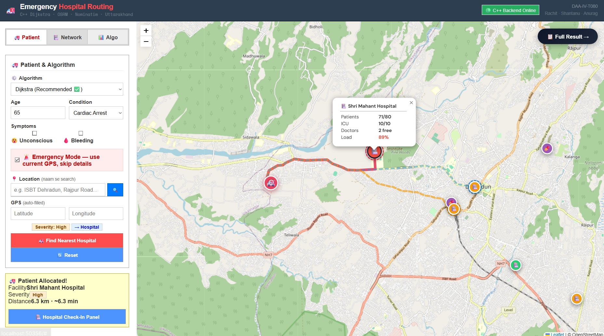
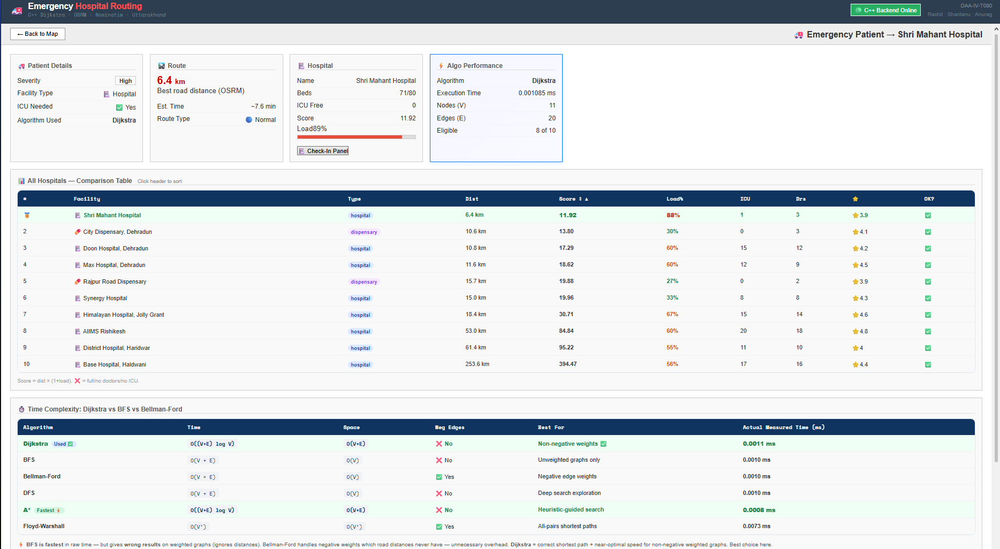

# 🚑 Emergency Hospital Routing System

A full-stack web application that intelligently allocates patients to the most suitable hospital based on severity, distance, and resource availability using advanced graph algorithms.

---

## 📌 Project Overview

Emergency Hospital Routing System is designed to simulate real-world emergency response by assigning patients to optimal hospitals based on:

- Patient severity  
- Distance (real road routes using OSRM)  
- Hospital load (beds, ICU, doctors)  

It provides:

- 📊 Real-time route visualization  
- 📈 Algorithm-based decision making  
- 📋 Interactive result dashboard  
- ⚙️ Hybrid allocation logic  

---

## 🧠 Algorithms Used

### 🔹 Dijkstra Algorithm
- Finds shortest path from patient to hospitals  
- Works on weighted graphs  

### 🔹 BFS (Breadth-First Search)
- Used for comparison (unweighted)  

### 🔹 Bellman-Ford
- Demonstration of negative edge handling  

### 🔹 Scoring System
```
score = distance × (1 + load)
```

- Lower score = better hospital  
- ICU priority for critical patients  

---

## 🏗️ System Architecture

```
User Input (Patient Details)
        ↓
Severity Calculation
        ↓
Location Fetch (Manual / GPS)
        ↓
C++ Routing Algorithm (Algos)
        ↓
Hospital Ranking
        ↓
Map Visualization (Leaflet + OSRM)
        ↓
Result Dashboard
        ↓
Check-In Panel
```

---

## 💻 Features

- ✅ Smart hospital allocation  
- 🗺️ Real-time map visualization  
- 📊 Multi-algorithm comparison  
- 📋 Hospital ranking system  
- 🏥 Check-in panel (room, doctor, budget)  
- 📍 Location search (Nominatim API)  
- 🚨 Emergency mode (auto GPS)  
- 🔄 Dynamic UI (tabs + sidebar + map)  

---

## 📊 Screenshots

### 🔹 Patient Form Interface


### 🔹 Map Routing Visualization


### 🔹 Result Dashboard


---

## 🏗️ Tech Stack

| Layer | Technology |
|------|-----------|
| Frontend | HTML, CSS, JavaScript |
| Map | Leaflet.js |
| API | OSRM, Nominatim |
| Backend | Node.js |
| Algorithm | C++ (Dijkstra) |

---

## 📁 Project Structure

```
│
├── backend/
│ ├── *.cpp / *.hpp (Graph Algorithms)
│ ├── main.cpp
│ ├── server.js (Node.js backend)
│ └── utils & models
│
├── frontend/
│ ├── index.html
│ ├── css/
│ ├── js/
│ ├── components/
│ └── documentation files
│
└── README.md
```

---

## ⚙️ How to Run

### 🔧 Requirements
- Node.js  
- g++  
- npm / npx  

---

### 🛠️ Steps

```
git clone https://github.com/rachit115/emergency_hospital_routing_system.git
cd emergency_hospital_routing_system
```

```
g++ -std=c++17 -O2 -o dijkstra *.cpp
```

```
node server.js
```

```
npx serve .
```

---

### 🌐 Open in Browser
```
http://localhost:3000
```

---


## 📈 Learning Outcomes

- Graph Algorithms (Dijkstra, BFS, Bellman-Ford, DFS , A* Algorithm,Floyd-Warshall Algorithm)  
- API Integration (OSRM, Nominatim)  
- Frontend + Backend Integration  
- Real-world routing simulation  

---

